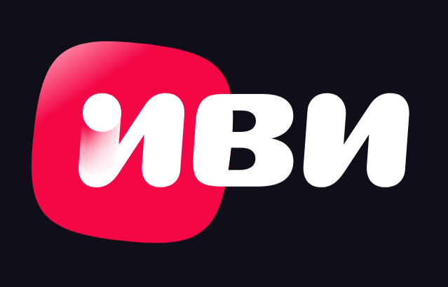
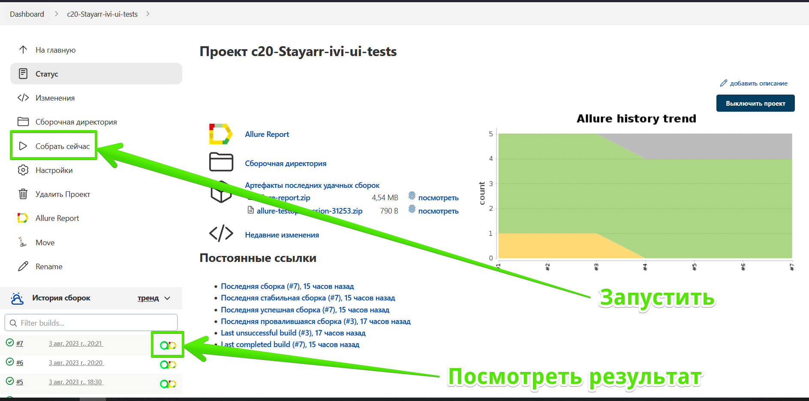
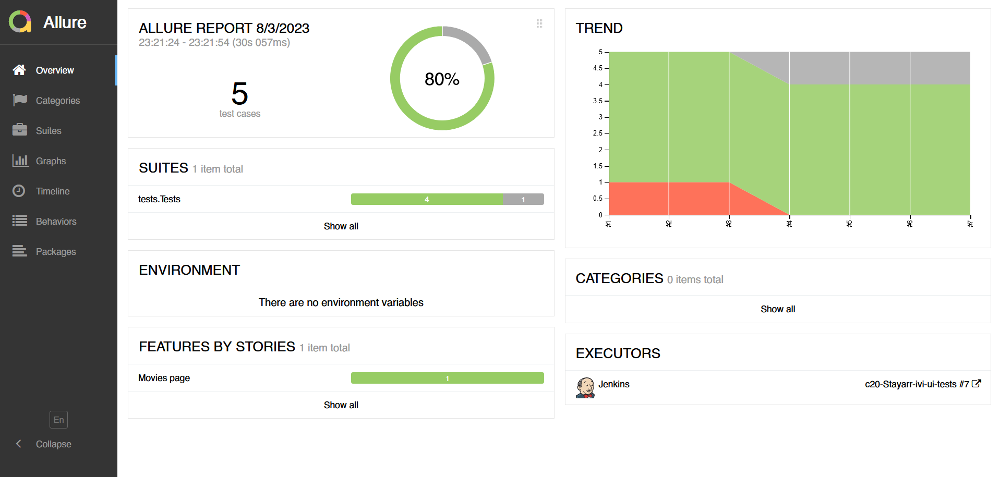
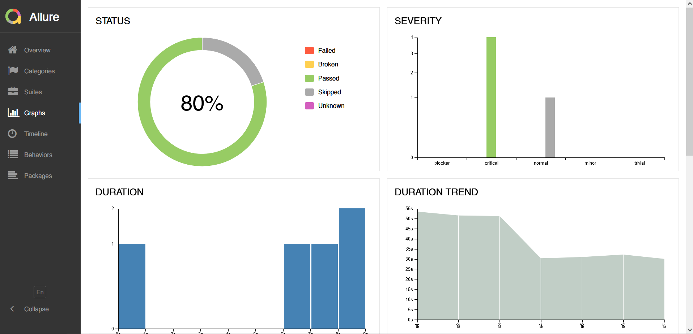
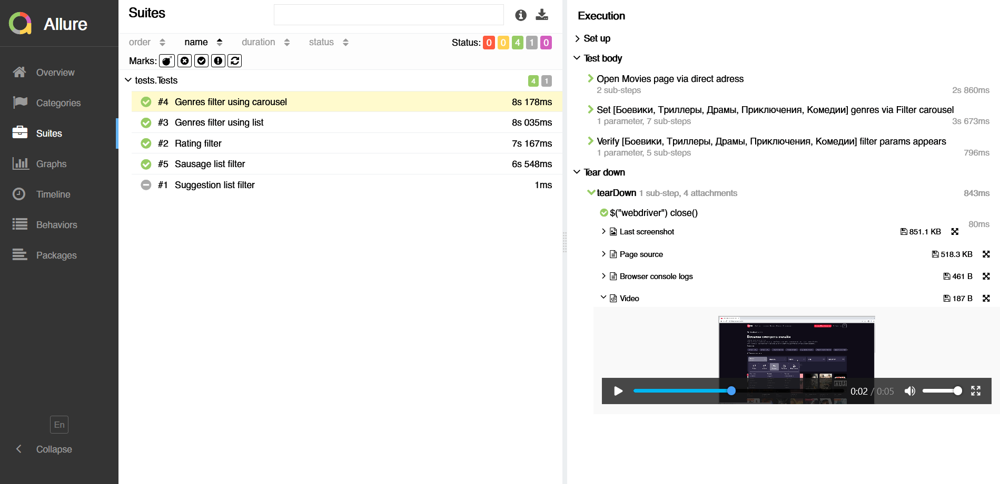
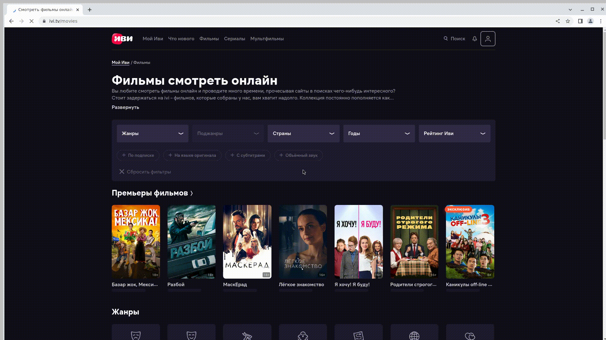
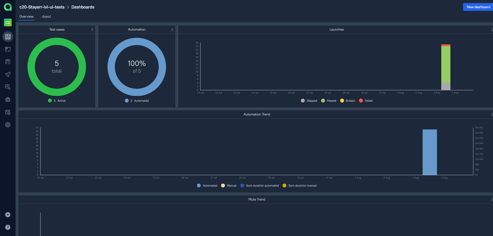
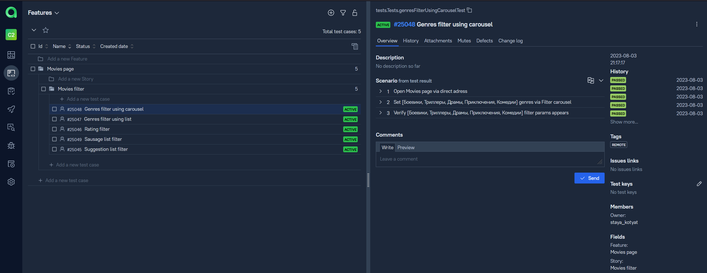
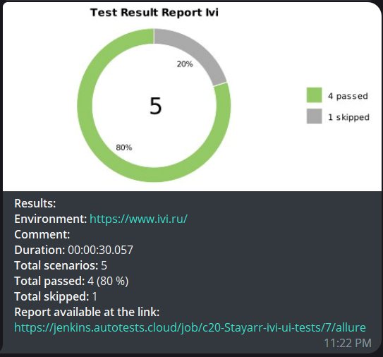

## Проект UI автотестов ivi.ru

<p align="center">
<a href="https://www.ivi.ru/"></a>

## Содержание
- [Что проверяем](#что-проверяем)
- [Запуск из терминала](#запуск-тестов-из-терминала)
- [Запуск проекта в Jenkins](#job)
- [Allure report](#-allure-report)
- [Видео прохождение теста](#видео-прохождение-теста)
- [Интеграция с Allure TestOps](#-интеграция-с-allure-testops)
- [Интеграция с Telegram](#-интеграция-с-telegram)

## Проект реализован с использованием

<p align="center">
<a href="https://www.java.com/"></a>
<a href="https://junit.org/junit5/"></a>
<a href="https://gradle.org/"></a>
<a href="https://selenide.org/"></a>
<a href="https://aerokube.com/selenoid/"></a>
<a href="https://github.com/allure-framework/allure2"></a>
<a href="https://www.jenkins.io/"></a>
<a></a>
<a></a>
</p>
<!-- Тест кейсы -->

### Что проверяем
* Проверка фильтра фильмов:
  * С помощью Suggestion list
  * По рейтингу
  * По жанру с помощью карусели
  * По жанру с помощью списка
  * С помощью Sausage list

## Запуск тестов из терминала
Локальный запуск:
```
gradle clean test -Denv=local
```

Удаленный запуск:
```
gradle clean test -Denv=${remote}
```

###  Запуск проекта в Jenkins

### [Job](https://jenkins.autotests.cloud/job/c20-Stayarr-ivi-ui-tests/)

##### При нажатии на "Собрать сейчас" начнется сборка тестов и их прохождение, через виртуальную машину в Selenide.


<!-- Allure report -->

###  Allure report
### [Report](https://jenkins.autotests.cloud/job/c20-Stayarr-ivi-ui-tests/allure/)
##### После прохождения тестов, результаты можно посмотреть в Allure отчете, где так же содержится ссылка на Jenkins


##### Во вкладке Graphs можно посмотреть графики о прохождении тестов, по их приоритезации, по времени прохождения и др.


##### Во вкладке Suites находятся собранные тест кейсы, у которых описаны шаги и приложены логи, скриншот и видео о прохождении теста


##### Видео прохождение теста


<!-- Allure TestOps -->

###  Интеграция с Allure TestOps

### [Dashboard](https://allure.autotests.cloud/project/3608/dashboards)

##### Так же вся отчетность сохраняется в Allure TestOps, где строятся аналогичные графики.


#### Во вкладке со сьютами, мы можем:
- Управлять всеми тест-кейсами или с каждым отдельно
- Перезапускать каждый тест отдельно от всех тестов
- Настроить интеграцию с Jira
- Добавлять ручные тесты и т.д




<!-- Telegram -->

###  Интеграция с Telegram
##### После прохождения тестов, в Telegram bot приходит сообщение с графиком и небольшой информацией о тестах.

